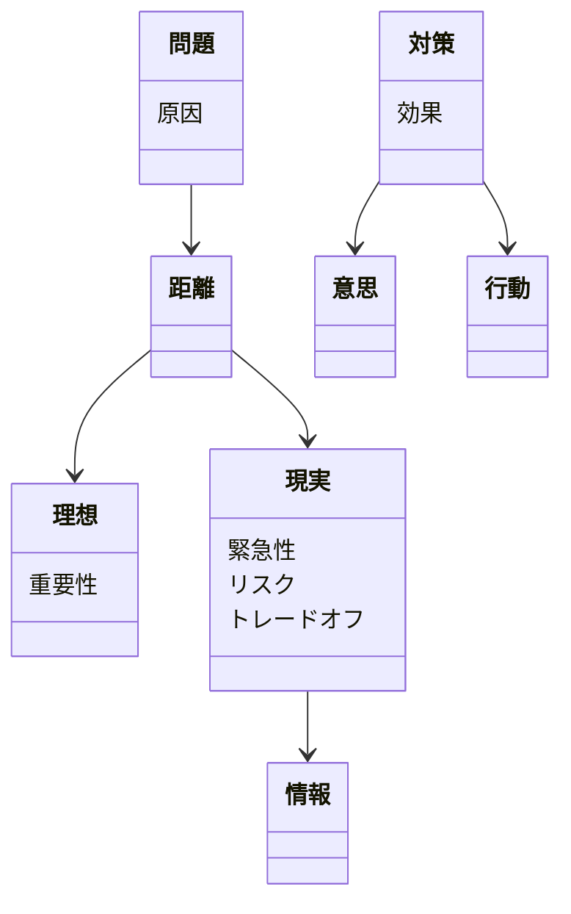

# 構成

## 学習、検査と適応

```mermaid
classDiagram

距離 --> 理想
距離 --> 現実
問題 --> 距離
現実 --> 情報

class 問題 {
    原因
}

class 理想 {
    重要性
}

class 現実 {
    緊急性
    リスク
    トレードオフ
}

対策 --> 意思
対策 --> 行動

class 対策 {
    効果
}
```
