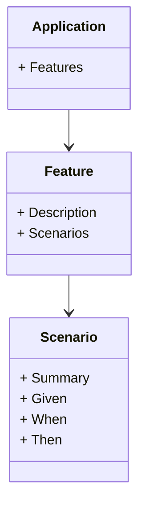

# テストの構造

```mermaid
classDiagram

Application --> Feature
Feature --> Scenario

class Application {
    + Features
}

class Feature {
    + Description
    + Scenarios
}

class Scenario {
    + Summary
    + Given
    + When
    + Then
}
```
