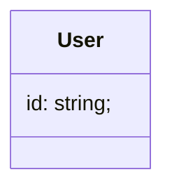
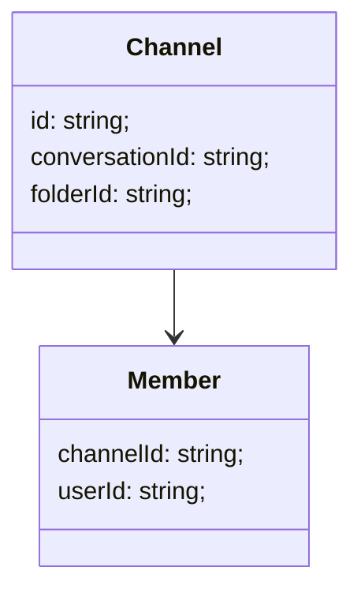
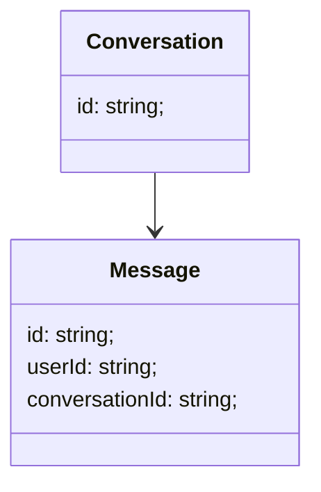
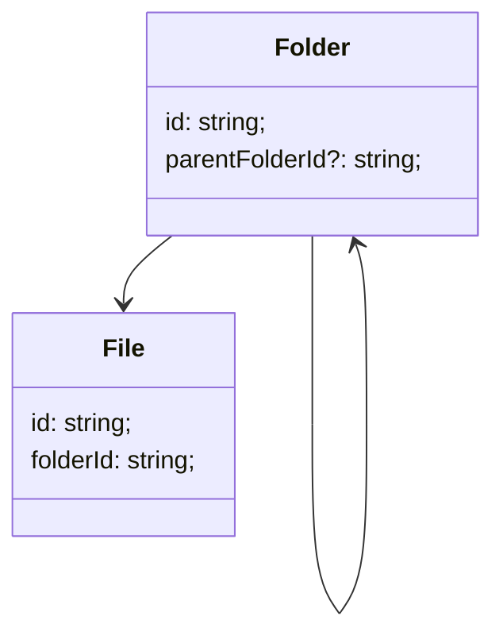

# チャットの拡張

Chatwork のようにチャットがファイルを持つようなサービスの設計

## User

```mermaid
classDiagram

class User {
    id: string;
}
```

## Channel

```mermaid
classDiagram

class Channel {
    id: string;
    conversationId: string;
    folderId: string;
}

class Member {
    channelId: string;
    userId: string;
}

Channel --> Member
```

## Conversation

```mermaid
classDiagram

class Conversation {
    id: string;
}

class Message {
    id: string;
    userId: string;
    conversationId: string;
}

Conversation --> Message
```

## File System

```mermaid
classDiagram

class Folder {
    id: string;
    parentFolderId?: string;
}

class File {
    id: string;
    folderId: string;
}

Folder --> File
Folder --> Folder
```
