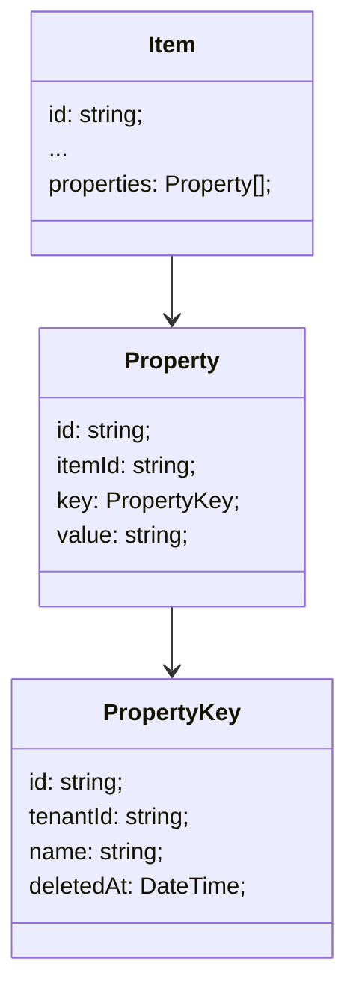

# 組織ごとの拡張プロパティ

## 概要

ある項目にプロパティを自由に追加できて、キーはテナントやユーザーごとに持たせる。

PropertyKey は論理削除にしておくと、後から復旧できる。
PropertyKey が削除されてないものだけをデフォルトで表示したり、編集できたり。

## 構造

## DB

Property の [keyId, itemId] で unique にする。

PropertyKey の name を unique にするかどうかは好みで。

## 拡張案

PropertyKey に type を持たせて、value をフォーマットできるようにする手もある。
type="json"の時は value を json としてデコードするとか。
