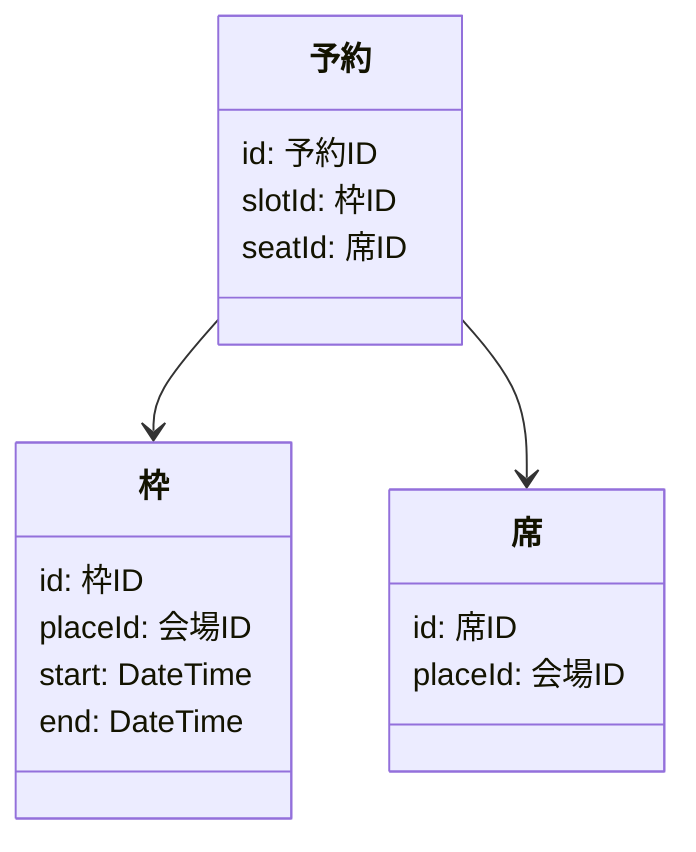
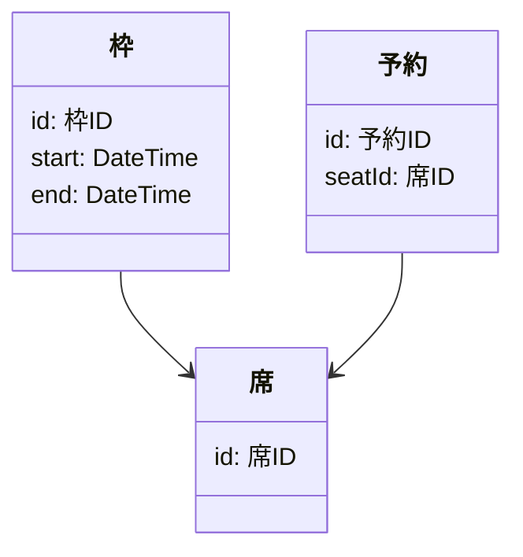

# 予約

予約機能は「席」と「枠」で捉える。

例えば「2022-11-25 09:30-11:30 枠の B 席」とか。

同じ席の同じ枠に予約が入らないように整合性を保証する必要がある。
そのためには、いきなり予約に時間を持たせるのではなくて、「枠」から用意する。

以下のような構造になっていれば、`reservation` の `seatId` と `slotId` をユニークにして整合性を保てる。

先の例では会場ごとに席を持っていたが、以下の例は枠ごとに席を持つ。
`reservation` の `seatId` をユニークにする。

枠に 1 人なら席は要らないけど、増えても対応できるようにデータベース上は持っておいた方がいいかも。

枠をある程度自由に決められる仕組みなら、15 分区切りとかで複数の枠を用意して長い枠として扱う。
全ての枠を確保できなかったらロールバックする。
